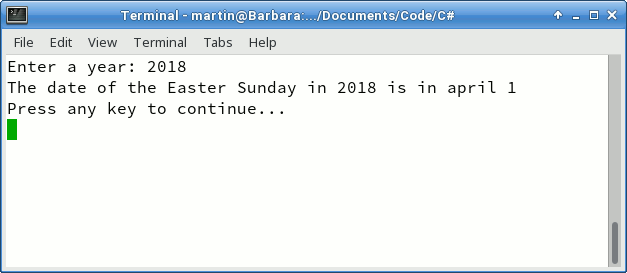
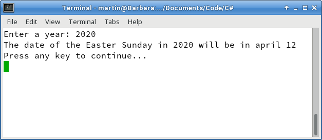
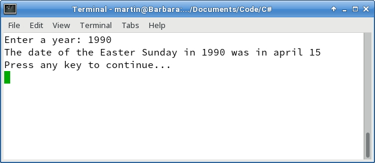

# How to calculate the date of the Easter Sunday.

    Easter is the celebration of Christ's resurrection from the dead. It is celebrated on Sunday, and marks the end of Holy Week, the end of Lent, the last day of the Easter Triduum (Holy Thursday, Good Friday and Easter Sunday), and is the beginning of the Easter season of the liturgical year.

    As we know from the Gospels, Jesus Christ rose from the dead on the third day following his crucifixion, which would be Sunday.
    Since the early Middle Ages, all Christians have used the same method for determining the date of Easter, though they arrive at a different result.

The following code calculates the easter sunday for a given year:

<b>Fig 1. Running the sample, output 1</b>
 

 

<b>Fig 2. Running the sample, output 2</b>
 

 

<b>Fig 3. Running the sample, output 3</b>
 

