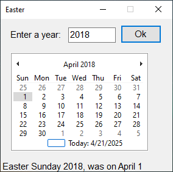
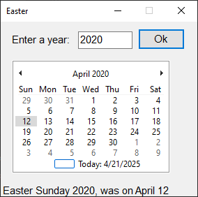
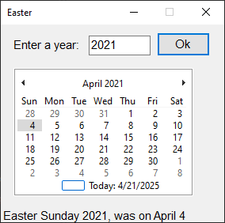
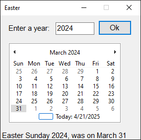

# How to calculate the date of the Easter Sunday.

Easter is the celebration of Christ's resurrection from the dead, comparable to Christmas, it is an important religious festivity on the Continent, and its traditions are not very different from those in other European countries.

It is celebrated on Sunday, and marks the end of Holy Week, the end of Lent, the last day of the Easter Triduum (Holy Thursday, Good Friday and Easter Sunday), and is the beginning of the Easter season of the liturgical year.

According to the Gospels, Jesus Christ rose from the dead on Sunday, the third day following his crucifixion. Since the early Middle Ages, Christians have used the same method for determining the date of Easter, though they arrive at different results.

The following C# code calculates easter sunday for a given year:

<b>Fig 1. Running the sample, output 1</b>
 

 

<b>Fig 2. Running the sample, output 2</b>
 

 

<b>Fig 3. Running the sample, output 3</b>
 

<b>Fig 4. Running the sample, output 4</b>
 

